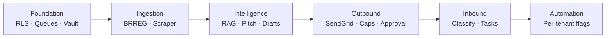
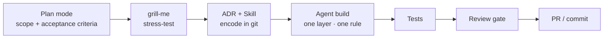

# Multi-Tenant Supabase Outreach Platform
## Presentation — SRS Analysis · Observations · AI-First Strategy

**Source:** `English Task Breakdown for a Multi-Tenant Supabase Outreach Platform.pdf`
**Audience:** Team research review

---

## How to use this document

Each section is one slide. **On screen** = what the audience sees. **Say** = speaker notes.
Optional live demo flow is at the end.

---

# Title

## Multi-Tenant Supabase Outreach Platform

**SRS Analysis · Observations · AI-First Development Strategy**

---

**Say:**

> "I reviewed the full SRS — roughly 200 checklist items across nine domains. My focus is not picking a favourite AI tool. It is: what the system actually is, where the real complexity lives, and the workflow we should use from day one to ship it safely with AI assistance."

---

# The Problem We Are Solving

## Not a CRUD app — a pipeline product

| Pillar | What it means |
|--------|---------------|
| **Multitenancy** | `tenant_id` + RLS on every exposed table |
| **Data pipelines** | BRREG + paid scraper + enrichment queues |
| **AI / RAG** | Content → embeddings → pitch signals → drafts |
| **Email infrastructure** | SendGrid outbound, events, inbound parse |
| **Compliance** | Norwegian / EU marketing law, sole proprietors |

**SRS baseline:** Supabase as system of record · paid scraper required · SendGrid for mail · payments deferred

---

**Say:**

> "The SRS assumes greenfield. The MVP covers prospect sourcing, enrichment, AI pitch and draft generation, controlled outbound sending, reply intake, classification, and seller task creation. That is a full operational platform — not a dashboard with a form."

---

# Architecture and Build Order



**Build order (from SRS):** Tenant core → Ingest → AI → Send → Inbound → Gradual automation

| Phase | Focus |
|-------|-------|
| **Alpha** | Tenant model, RLS, BRREG, enrichment adapter |
| **Beta** | Content ingestion, signals, pitch object, drafts (manual approval) |
| **Gamma** | Domain onboarding, send scheduler, SendGrid events |
| **Delta** | Inbound parse, reply classification, seller tasks |
| **Epsilon** | Selective auto-replies, calendar booking, offers |

---

**Say:**

> "Phases Alpha through Epsilon are already defined in the PDF. We do not touch SendGrid until Gamma. That sequencing is intentional — most security and data-quality decisions happen before a single email is sent."

---

# Five Observations Others Will Miss

| # | Observation | Risk if ignored |
|---|-------------|-----------------|
| 1 | BRREG open data has **no emails** — paid scraper is blocking | Empty outbound queue |
| 2 | Storage backups **≠** database backups | Lost audit evidence |
| 3 | SendGrid Subusers: on-behalf-of **does not work** with Mail Send API | Delivery failures |
| 4 | Event webhook signature = **raw body**; Inbound Parse = **multipart** | Security holes, duplicate messages |
| 5 | Compliance is **architectural** — Datatilsynet, sole proprietors | Legal exposure |

---

**Say:**

> "These are design constraints, not footnotes. The PDF calls out webhook verification nuance explicitly. Teams that vibecode SendGrid integration will get broken signature checks and duplicate inbound messages. We need test-first implementation and idempotency keys from the start."

---

# Recommended Stack

| Layer | Choice |
|-------|--------|
| Frontend | Next.js 15+ · TypeScript · Server Actions |
| Platform | Supabase — Auth, Postgres, RLS, Vault, Queues, Storage |
| AI / search | pgvector + Edge Functions |
| Email | Twilio SendGrid |
| Tests | Vitest (unit) · Playwright (E2E from Gamma) |

**Already validated:** Lead Gate — first business rule from the PDF, shipped with tests

---

**Say:**

> "This matches the SRS baseline. Lead Gate proves it: missing email → excluded with reason, tenant_id on every row, server-only Supabase client, passing unit tests. That is the first business rule from this exact backlog — not a unrelated demo."

---

# Our AI Operating System



**Principle:** We evaluate **process maturity**, not line count.

| Bad prompt | Good prompt |
|------------|-------------|
| "Build the outreach platform from the PDF" | "Implement `qualifyLead()` per skill: null email → `excluded`, reason `missing_email`. Add 3 Vitest cases. Do not touch UI." |

---

**Say:**

> "The mistake is one giant Agent prompt. The winning pattern is one layer, one rule, one test expectation. Plan mode scopes it. Grill-me finds gaps — RLS leaks, webhook body handling, Storage backup. ADR and project skills encode decisions in git. Review gates catch what generation misses."

---

# Tools, Skills, and Quality Gates

### Skills (trusted sources)

| Skill | Purpose |
|-------|---------|
| **grill-me** | Plan stress-test before coding |
| **supabase** | Migrations, RLS, Edge Functions |
| **supabase-postgres-best-practices** | Indexes, RLS patterns, query performance |
| **outreach-platform** (custom) | PDF domain rules in git |

### MCP progression

| Stage | Server | Purpose |
|-------|--------|---------|
| Start | GitHub | Issues, PRs, repo context |
| Alpha | Supabase MCP | Schema, migrations, type generation |
| Gamma | Playwright | E2E flows |

### Quality gates

**SonarLint** (while coding) → **Agent Review** (pre-commit) → **CodeRabbit** (pre-merge)

---

**Say:**

> "Supabase ships an official MCP server and agent skills. MCP connects Agent to our dev database — dev project only, manual tool approval. Skills are the team moat: lead states, exclusion rules, no PII in SendGrid metadata — all in version control, not chat history."

---

# Phase Alpha Scope

| Task | Done when |
|------|-----------|
| Supabase project + migrations repo | CI deploys schema |
| Tenant tables + RLS on all exposed tables | Cross-tenant read attempt fails |
| BRREG adapter (search, bulk, delta) | Companies imported with orgnr |
| Enrichment adapter (provider abstraction) | Normalized output contract works |
| Lead qualification rules | `missing_email` → excluded; reason visible in UI |
| Audit log for tenant-sensitive actions | Domain setup and send events logged |

**Exit criteria:** Tenant imports companies · excluded leads kept for enrichment · RLS verified

---

**Say:**

> "Alpha is the foundation everything else depends on. Exit criteria: a tenant can import companies, leads without email are excluded but kept for enrichment, and RLS is verified with an explicit cross-tenant test. Beta and beyond build on this — they do not replace it."

---

# Why This Research Stands Out

| Typical research | This approach |
|------------------|---------------|
| "Use Cursor and ChatGPT" | Repeatable workflow with evidence |
| Tool list, no SRS mapping | Every recommendation tied to a PDF item |
| "AI builds faster" | Lead Gate proof + tests + ADR + grill-me Q&A |
| Compliance as afterthought | Datatilsynet, suppression, no PII in metadata — from Alpha |
| One big MVP | Phased rollout Alpha → Epsilon |

### Lead Gate proof point

| Concern | Demonstrated |
|---------|--------------|
| Structured AI workflow | Plan → grill-me → skills → build → test → review |
| Real backlog connection | PDF rule: no email → excluded, reason shown |
| Security awareness | RLS + server-only secrets + review gate |
| Stack validation | Next.js + Supabase + TypeScript |

---

**Say:**

> "I am not competing on who found the most tools. I am competing on who can start Phase Alpha with a workflow that prevents expensive mistakes — RLS gaps, webhook bugs, Storage data loss, SendGrid misconfiguration. The proof is Lead Gate plus this phased plan."

---

# Decisions and Next Steps

### Decisions needed

1. **Approve Phase Alpha scope** — tenant model, RLS, BRREG, enrichment adapter
2. **Create Supabase dev project** — MCP scoped to dev only
3. **Author `outreach-platform` skill** in repo — PDF rules in git
4. **Legal review spike** — B2B vs sole proprietor, consent requirements
5. **SendGrid ADR** — shared account vs Subuser per tenant (before Gamma)

### Commitment

> Structured AI workflow on every feature slice — Plan, grill-me, ADR, scoped build, review, test.

---

**Say:**

> "I am ready to lead Phase Alpha planning and create the project skill. I need alignment on Alpha scope and a dev Supabase project. SendGrid account model can wait until Gamma, but the ADR should start now so we are not surprised by Subuser pricing. Questions?"

---

# Optional — Live Demo Flow

Use if the audience asks for hands-on proof.

| Step | Show |
|------|------|
| 1 | Lead Gate — "PDF rule #1, built with structured AI workflow" |
| 2 | `LeadGate/docs/grill-me-qa.md` — questions that changed the plan |
| 3 | Skills folder — grill-me, supabase, lead-qualification |
| 4 | Live submit — no email → **Excluded**; valid email → **Outbound ready** |
| 5 | `npm test` — passing unit tests |
| 6 | Agent Review output — one fix applied |
| 7 | Close — "Same workflow scales to full outreach platform Phase Alpha" |

Repo: `LeadGate/` · Script: `LeadGate/docs/DEMO-SCRIPT.md`

---

# Appendix — Anticipated Q&A

**Why not .NET?**
The SRS baselines Supabase + Edge Functions + RLS. Lead Gate validates Next.js + Supabase. If the team overrides, document it in ADR-002 with tradeoffs — the PDF is the current source of truth.

**Can AI build the whole platform?**
AI accelerates scaffolding, migrations, adapters, and tests. RLS design, compliance, SendGrid ops, and queue idempotency need human review gates. The workflow enforces that.

**What defines MVP readiness?**
Alpha: tenant isolation + ingestion + qualification. Gamma: controlled sending with human approval. Epsilon: per-tenant automation via feature flags — not a single big-bang release.

**What about security?**
Vault for secrets. RLS on every table. No service_role client-side. No PII in SendGrid metadata. Webhook signature on raw body. SonarLint + CodeRabbit before merge. All called out in the SRS.

**Why skills instead of prompts?**
Skills persist team knowledge in git. Prompts evaporate. Every new Agent session loads PDF rules automatically — lead states, exclusion reasons, tenant_id requirement.

**What is the daily send target?**
The SRS specifies roughly 20 emails per day per business target, with per-mailbox caps, business-hour rules, and human approval gates in V1 — not unlimited blast sending.

---

# Appendix — SRS Non-Negotiables (Cheat Sheet)

```
Stack       Next.js + Supabase + SendGrid + paid scraper + pgvector
Build order Tenant/RLS → Ingest → AI drafts → Send → Inbound → Auto

AI workflow Plan → grill-me → ADR → skill → Agent (scoped) → test → review → PR

Skills      grill-me | supabase | postgres-best-practices | outreach-platform

MCP         GitHub → Supabase (Alpha) → Playwright (Gamma)

Rules       tenant_id + RLS on every exposed table
            Vault for all third-party secrets
            No PII in SendGrid metadata
            Webhook signature on RAW request body
            Storage backup ≠ database backup
            missing_email → excluded (keep row for enrichment)

Proof       Lead Gate (PDF rule #1)
```
